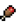
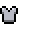
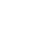

## Glyph_E1
Autogenerated with [rego-glyph](https://github.com/llgava/regolith-filters/tree/main/rego-glyph) filter by `Leonardo '_Fyat' Gava`

| Hex | Unicode | Symbol | Preview | Position |
|-----|-----|-----|-----|-----|
| 0xE100 | U+E100 | &#57600; |  | (0, 0) |
| 0xE101 | U+E101 | &#57601; |  | (1, 0) |
| 0xE102 | U+E102 | &#57602; |  | (2, 0) |
| 0xE103 | U+E103 | &#57603; |  | (3, 0) |
| 0xE104 | U+E104 | &#57604; |  | (4, 0) |
| 0xE105 | U+E105 | &#57605; |  | (5, 0) |
| 0xE106 | U+E106 | &#57606; |  | (6, 0) |
| 0xE107 | U+E107 | &#57607; |  | (7, 0) |

## Support
Found a issue? 
Open it [here](https://github.com/llgava/regolith-filters/issues) so I can check and fix if needed.
